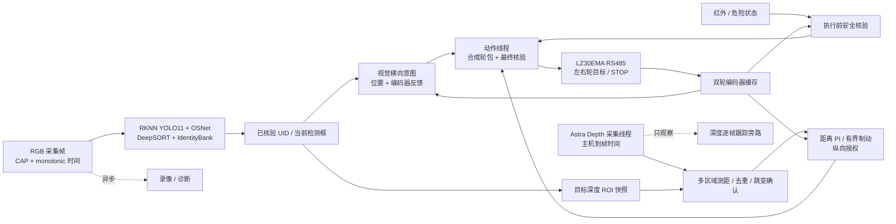

# RK3588 跟随车项目架构与双人开发交接文档

适用目录：`/home/topeet/Desktop/rk_car_runtime_module_270930`。维护日期：2026-10-09。

项目在 RK3588 上完成单目标人员跟随：检测人、确认身份、测量目标深度，再将距离与横向位置变成双轮运动。交接对象是两位共同维护感知和运动控制的开发者。开发时必须区分**看到了人、确认了目标、获得了新测量、批准了运动、实际发包、轮子实际响应**，它们是不同阶段，不能互相代替。

建议先读第 1～4 章建立整体认识，再读第 5～6 章掌握授权边界；第 9～10 章直接用于分工与提交验收，第 11～14 章用于日常开发、排障和正式交接。本文的当前行为以活动代码和主配置为准，历史实验报告只解释改动背景。

| 阅读主题 | 章节 |
| --- | --- |
| 版本与启动入口 | [1 版本边界与阅读入口](#1-版本边界与阅读入口) |
| 参数基线 | [2 当前运行配置速览](#2-当前运行配置速览) |
| 目录与接口 | [3 数据流和模块所有权](#3-数据流和模块所有权) |
| 线程与锁 | [4 启动线程与停机](#4-启动线程与停机) |
| 身份与深度授权 | [5 身份深度与运动授权](#5-身份深度与运动授权) |
| 轮速与停车 | [6 从纵横向请求到实际轮包](#6-从纵横向请求到实际轮包) |
| 依赖与部署 | [7 配置依赖与交付](#7-配置依赖与交付) |
| 日志与指标 | [8 诊断输出和定位顺序](#8-诊断输出和定位顺序) |
| 双人协作 | [9 双人开发职责与变更流程](#9-双人开发职责与变更流程) |
| 测试与验收 | [10 测试分层与验收](#10-测试分层与验收) |
| 首次接手 | [11 新开发者上手流程](#11-新开发者上手流程) |
| 排障速查 | [12 常见问题排查手册](#12-常见问题排查手册) |
| 风险与演进 | [13 已知限制与后续演进](#13-已知限制与后续演进) |
| 交接清单与索引 | [14 交接完成检查表](#14-交接完成检查表) |

## 1 版本边界与阅读入口

当前分支为 `20270930_better`，代码与仓内运行资源已打包在提交 `e8645f59f75145b5568784c7d9263e52819c3a37`（`Package reconstructed RK3588 follow car runtime snapshot`）。目录名和分支名不是运行日期。该提交已经包含重建后的核心源码和运行资源，不应再沿用“核心代码仍大量未提交”的旧描述。正式交付时，另记录包含交接文档的最终提交及 `git status --short`；源码提交不能代替设备状态记录。

此版本由历史代码及修改记录重建后打包，不是原设备在历史时点的完整磁盘快照。板端已安装依赖、驱动器寄存器状态和历史录像不由 Git 提交恢复。`.reconstruction/` 是本机忽略的重建审计附件；需要交付这部分时单独打包，不作为程序运行依赖。源码、模型和仓内驱动以当前提交为基准，硬件状态另作现场登记。

当前实车入口是 [run_request_0428_modular.sh](../run_request_0428_modular.sh)，它固定启动 [request_0513_modular.py](../request_0513_modular.py)。默认配置是 [reid_runtime.ini](../car_control_modular/config/reid_runtime.ini)。`request_0428_modular.py`、`request_0512_modular.py` 是旧入口/对照，不是这条启动脚本的主路径。

以下是**会启动传感器和电机控制**的实车入口，不是离线检查；须由现场负责人确认路径净空并准备硬件急停后运行：

```bash
cd /home/topeet/Desktop/rk_car_runtime_module_270930
sudo -v
./run_request_0428_modular.sh --config car_control_modular/config/reid_runtime.ini
```

启动脚本切到自身目录，限制 NumPy/OpenBLAS 默认线程数为 1，创建本次独立日志目录，随后启动 Python。按 `Ctrl+C` 走 Python 停车与资源释放；若清理超时，脚本执行独立电机安全收尾。MP4 转码在小车进程结束后运行。脚本只保留最近 **3** 个受管运行目录，重要日志应在下一次轮换前另行归档。不要通过 `sudo ./run_request_0428_modular.sh` 运行整个脚本，以免录像和日志变成 root 所有。

## 2 当前运行配置速览

以下值来自活动 INI，运行时还可能经配置加载器的显式试验开关、自动派生规则修改；看某次实车表现应以该次启动日志的配置打印和寄存器读回为准。

| 范围 | 当前配置 | 对行为的含义 |
| --- | --- | --- |
| 感知 | RKNN YOLO11n 人体检测 + OSNet x0.25 ReID（128×256 输入）；RGB 640×480、30 FPS，`opencv_v4l2` | YOLO 类别 `C0` 表示“人”，不等于已确认目标 UID；画面采集频率不等于有效身份或测距频率。 |
| 距离与传感器 | `distance.source=vision_depth`；Astra Depth 开启；IIO 红外开启；毫米波/超声波/沙坑识别关闭；IMU 开启但只作诊断 | 前进距离来自与目标绑定的深度 ROI；编码器参与控制与保护。 |
| 目标与纵向 | 目标距离 1.4 m；`distance_pi`；Kp=3.0/s、Ki=0.4/s²、积分补偿上限 0.8 m/s；追赶请求基准 180 RPM，按 0.5 m 有效误差尺度衰减 | 追赶分量与 PI 需求组合，近距不是固定请求 180；它也不是实发最低转速。最终仍受新鲜度、制动、反馈及电机限幅约束。旧 `approach`/`legacy` 可作对照。 |
| 横向 | 图像位置主导的视觉转向；横向意图名义期限 150 ms；30 Hz 计算；通常单轮修正上限 10 RPM | 正常目标轮速为 `左 = 前进基速 + 横向修正`、`右 = 前进基速 - 横向修正`；10 RPM 单轮修正对应最多约 20 RPM 双轮差。近距、弱证据等可进一步收紧。 |
| 深度时效 | 框最长 250 ms；新 PI 更新要求新深度到帧时间不超过 180 ms；已批准前进可在额外检查下延续到样本后最多 250 ms | 框期限、测量期限、已批准运动期限是不同的时钟；重复深度不能刷新原始到帧时间。 |
| 电机 | LZ-30EMA_2EC_N，`/dev/ttyS0`、slave 1、115200，轮速绝对上限 200 RPM；0x005F 闭环加速度 600 RPM/s | 启动停车后临时写加速度并读回，不改 0x0060 减速度，也不写入断电保持设置；左右安装符号由 INI 映射。 |

`auto_tune_follow_distance=true` 会按 1.4 m 目标重新派生部分前进、近距、倒车阈值。例如倒车启动/停止实际约为 1.20/1.35 m，不能直接把 INI 中的 `reverse_start_distance_m=1.30`、`reverse_stop_distance_m=1.45` 当作当前生效值。PI 使用 0.03 m 死区和假设 0.40 m/s² 的制动模型；这是软件预测值，不是实测制动能力，也不是“到 1.1 m 才停车”的固定开关。`brake_distance_m=0.5` 当前并不把深度距离直接接入动作线程的硬停门。

## 3 数据流和模块所有权

### 目录导航

```text
rk_car_runtime_module_270930/
├── run_request_0428_modular.sh    当前启动器 名字保留历史日期
├── request_0513_modular.py       当前总编排与跨模块适配入口
├── car_control_modular/         感知测距 控制 状态交接 动作与电机
│   ├── config/reid_runtime.ini  默认活动配置
│   ├── control_types.py         跨模块数据类型
│   └── vendor/                 旧电机协议参考 非当前活动驱动
├── rk_vision/                   RKNN 检测 ReID 轨迹与身份库
│   └── deepsort/                运动关联与局部轨迹
├── ir_hal.py imu_hal.py         当前红外与 IMU 板端适配
├── mmwave_hal.py utrasonic_hal.py 可选测距设备适配
├── models/                     活动 RKNN 模型与转换说明
├── librknnrt.so                 ARM64 RKNN 运行库
├── runtime_dependencies/       仓内 OpenNI 与 LZ30EMA 驱动源码
├── tests/                      离线回归及明确标注的联机工具
├── tools/                      日志分析 回放 标定 实机专项工具
├── scripts/ docker/ third_party/ 模型转换与跨环境实验支持
├── docs/                       当前交接文档与历史专题报告
└── run_request_0428_modular_logs/ 受自动轮换管理的运行产物
```

根目录另有 `controllers.py`、`config_loader.py`、`reid_runtime.ini` 和旧 request 文件。主入口显式导入的是 `car_control_modular` 包，默认加载其 `config/reid_runtime.ini`。**不要因为同名就同时修改两份文件**；先用导入语句和启动日志确认实际路径。根目录旧文件可用于历史比较，不作为新功能的默认落点。

### 主数据流



| 代码位置 | 当前职责和主要边界 |
| --- | --- |
| [request_0513_modular.py](../request_0513_modular.py) `PersonTracker` | 运行入口与编排：创建各模块、维护活动 UID/搜索状态、发布测距框、序列化视觉与深度控制更新、将决策放入动作队列。它仍是大量共享运行状态的拥有者。 |
| [rk_vision/pipeline.py](../rk_vision/pipeline.py)、[yolo11.py](../rk_vision/yolo11.py)、[reid.py](../rk_vision/reid.py) | 画面进入 RKNN 检测/全身与躯干外观提取，输出框、特征、阶段耗时和诊断。NPU 负责模型推理；裁剪、后处理、关联与状态机在 CPU。 |
| [rk_vision/tracker.py](../rk_vision/tracker.py)、[identity_bank.py](../rk_vision/identity_bank.py)、[template_memory.py](../rk_vision/template_memory.py) | DeepSORT 原始轨迹与长期 UID 区分；身份库负责建库、复核、外观/几何竞争、模板隔离和接回。原始轨迹号相同并不能单独证明是同一人。 |
| [car_control_modular/sensor_modules.py](../car_control_modular/sensor_modules.py)、[astra_depth.py](../car_control_modular/astra_depth.py) | 打开/关闭板上传感器；深度采集线程缓存物理帧；按身份绑定的 ROI 测距，进行多躯干区域前景聚类、有效像素和跳变确认。 |
| [car_control_modular/distance_runtime.py](../car_control_modular/distance_runtime.py)、[depth_target_geometry.py](../car_control_modular/depth_target_geometry.py) | 选择距离源，检查检测框来源、UID、采集时间和 ROI 资格；输出带原始/滤波距离及时间状态的 `DistanceState`。毫米波匹配代码保留，但不在当前配置中运行。 |
| [car_control_modular/controllers.py](../car_control_modular/controllers.py)、[distance_pi.py](../car_control_modular/distance_pi.py)、[steering_pid.py](../car_control_modular/steering_pid.py) | `FollowSafetyController` 负责目标/搜索/停车/倒车决策；距离 PI 给纵向请求与制动上限；视觉 PID 给横向修正。旧控制器和旧模式在文件中保留，不能因存在代码就当成当前路径。 |
| [car_control_modular/lateral_intent.py](../car_control_modular/lateral_intent.py)、[action_runtime.py](../car_control_modular/action_runtime.py) | 横向 latest-value 意图及动作执行；普通跟随由动作线程合成左右轮，检查时效、安全、残余轮速和换向，再发包。搜索、倒车与停车有各自状态门。 |
| [car_control_modular/mssd_motor.py](../car_control_modular/mssd_motor.py)、[motor_rtu.py](../car_control_modular/motor_rtu.py)、[motor_ramp.py](../car_control_modular/motor_ramp.py) | 将轮速映射为带安装符号的协议值；串口 RTU 事务与故障锁存；启动时加速度寄存器设置和读回。`mssd` 是兼容旧文件名，活动驱动器是 LZ30EMA。 |
| [car_control_modular/control_types.py](../car_control_modular/control_types.py) | 跨模块的冻结数据结构：`PersonTarget`、`DepthTargetObservation`、`DistanceState`、`SteeringFeedback`、`SensorFrame`、`ControlAction`、`ControlDecision`、`DepthLinearTiming`。 |

当前运行额外使用 [startup_identity.py](../car_control_modular/startup_identity.py)、[search_candidate_gate.py](../car_control_modular/search_candidate_gate.py)、[search_observation_retry.py](../car_control_modular/search_observation_retry.py)、[near_yaw_parking.py](../car_control_modular/near_yaw_parking.py) 等小模块。它们解决特定状态交接，不应被当成另一个并行电机控制器。[depth_track_online.py](../car_control_modular/depth_track_online.py) 默认只写 `shadow_only` 观测，没有前进授权接口。

核心跨层数据契约：

| 类型 | 关键字段与约束 |
| --- | --- |
| `TrackRecord` | `track_id` 为 DeepSORT 原始轨迹号，`reid_uid` 为身份库本帧结果，`time_since_update>0` 表示预测补帧；当前配置不把预测补帧用于运动控制。 |
| `PersonTarget` | 此层 `track_id` 已转换成控制层使用的稳定 UID，**不再是上行 `TrackRecord.track_id`**。含展示/转向框、置信度、面积、`depth_observation`、`braking_observation`、首次建库证明；没有通用 `bbox_quality` 字段。质量明细留在 tracker 的身份观测元数据，由入口核验后转换。 |
| `DepthTargetObservation` | 原始检测框、UID、原始轨迹号、CAP、RGB 到帧时间一起传递；只有匹配当前锁定 UID 的新观测才能作为普通测距来源。 |
| `DistanceState` | `raw_distance_m`、`filtered_distance_m`、`used_distance_m`、`sample_timestamp`、`observation_timestamp`、`temporal_status` 分别描述数值和来源；重复/旧样本不等于新测量。 |
| `DepthLinearTiming` | 将已提交的纵向 `snapshot` 与实际深度期限、前馈期限分开；消费者不得靠处理时间或另一个时钟延长原授权。 |
| `LateralControlIntent` | 绑定 UID、CAP/采集时间、修正量与名义到期时间；执行线程使用前再次核验，意图过期不构成新的前进授权。 |
| `MotorSpeedReceipt` | 记录已成功写入的一对轮速、顺序号和完成时间；它是串口命令回执，不是地面速度测量。 |
| `ActionCommandSnapshot` | 动作队列携带动作、revision、入队时刻、控制帧、CAP、采集时间、reason、source_module、UID、soft_stop 和 protected_stop。新版本淘汰旧普通动作；受保护 STOP 不因 revision 变化而取消。 |
| `ForwardExecutionAnchor` | 绑定同 UID、原深度样本、实际成功发包的 RPM、完成时间和回执对象。只为新合法深度接续提供内部起点，不得续旧授权或覆盖 STOP。 |

`frozen=True` 只禁止 dataclass 字段重新赋值，不会自动冻结内部 list/dict。跨线程发布后不得继续原地修改其中的嵌套数据；变更时创建新的快照并保留版本/来源检查。

### 单位和编号约定

| 量 | 约定 | 常见误用 |
| --- | --- | --- |
| YOLO `C0` 与 confidence | 类别 0 是人；置信度越大越像该类别 | 把 0.95 检测置信度当作 95% 是原目标 |
| ReID distance | 特征距离越小越相似；不是身份概率 | 把低距离作为绕过竞争、几何矛盾的充分条件 |
| UID 与 raw track | UID 是业务身份；raw track 是一次局部轨迹编号 | 同轨迹号就不复核身份，或换轨就必然换人 |
| 距离和线速度 | m、m/s；配置/控制计算中注意个别设备原始 cm/mm | 把毫米波 cm、深度 mm 直接带入米制 PI |
| 轮速和百分比 | RPM；`speed_percent` 是百分比，不是 RPM | 当前 200 RPM 上限下将 30% 误解为 30 RPM |
| 横向修正 | 单轮修正 RPM；右转为正时左快右慢，总轮差为两倍修正 | 把单轮 10 RPM 当双轮差 10 RPM |
| 角速度 | 度/秒，`yaw_rate_right_dps` 右转为正 | 与弧度/秒或相机目标向左的图像速度混用 |
| 时间 | 内部期限使用 `time.monotonic()` 秒，日志常显示 ms | 用墙钟替代单调时间，或以处理时间重置采集年龄 |
| CAP 与 VIDEO | CAP 为采集序号，VIDEO 为录像写入序号；控制帧另计 | 把录像第 300 帧直接当 CAP300 或控制帧300 |

26 cm 轮径对应理论周长约 0.817 m，`v = RPM × 0.817 / 60`。这是理想轮速换算，不是地面真值；轮胎打滑、驱动反馈刻度及车体几何需独立标定。

## 4 启动线程与停机

1. [配置加载器](../car_control_modular/config_loader.py) 在主脚本导入阶段读取 `--config`，将 INI 映射到环境变量，然后主脚本创建运行常量和 `PersonTracker`。默认启动脚本已选好 INI。
2. 构造阶段初始化传感器、视觉管线、危险模块和控制状态；`run()` 先在**本进程的电机 I/O 锁内**打开串口，完成初始停车、驻车与 0x005F/0x0060 读回，再启动动作/编码器、横向意图、纵向深度线程。这把锁不阻止其他进程打开同一个串口。
3. 当前启用方向历史和默认 2 个方向推理 worker，因此 RGB 采集线程是相机单一读取者。有界队列满时丢旧帧，主循环取最新帧。录像和方向推理是侧路，不得让侧路失败夺走已采到的控制画面；方向 worker 本身仍运行 RKNN 检测，会占用 NPU/CPU 资源。若显式关闭方向 worker，主循环会改为直接读取相机。主循环处理每个新画面并发布本次可靠 UID/ROI。
4. Astra 独立采集深度图。纵向线程标称 30 Hz，并在新 ROI 发布时被立即唤醒；横向线程约 30 Hz 用最新编码器反馈更新意图；编码器线程约每 50 ms 读取双轮状态。普通可见跟随轮包由动作线程按约 50 ms 周期尝试更新。周期是调度目标，不能当作必然产生新身份、新深度或新串口写入的频率。
5. 主循环与纵向线程共用 `_control_update_lock` 保护控制器/测距决策；纵向线程忙时短时重试最新快照。动作线程和编码器读取共用 `motor_io_lock`，防止**本进程内**同一 RS485 总线事务交叉；普通纵向/横向生产者不自行写电机。启动、停车、安全与退出还有受控的直接 STOP 路径。
6. 退出信号先锁存禁止运动并尝试 STOP，再停止线程并关闭电机、录像、相机、视觉、传感器。主脚本对可能卡住的设备释放设超时；启动脚本超过退出宽限后另用 `tools/force_motor_safe_stop.py` 收尾。

### 线程与队列清单

| 任务 | 入口或模块 | 调度和缓冲 | 可以改变什么 |
| --- | --- | --- | --- |
| RGB 采集 | `PersonTracker._capture_loop` | 相机约 30 FPS，主控采集队列有界，满时丢旧 | 发布 CAP、到帧时间和图像，不写电机 |
| 主视觉控制 | `run` / `process_external_frame` | 取新图像，串行运行检测身份和控制适配 | 核验身份、发布 ROI、控制决策 |
| 方向补充推理 | `DirectionInferencePool` | 默认 2 worker；`RKNN_DIRECTION_QUEUE_SIZE=0` 是无界任务队列 | 发布方向证据，不等于确认 UID 或授权前进 |
| 深度采集 | `AstraDepthRuntime` | 深度设备约 30 FPS，缓存到帧时间和图像 | 保存新深度；测距由测量接口另行执行 |
| 纵向监督 | `_longitudinal_control_loop` | 标称 30 Hz，新 ROI 可唤醒 | 验证新测量、PI、提交或撤销纵向授权 |
| 横向意图 | `_lateral_intent_control_loop` | 标称 30 Hz，使用现有反馈缓存 | 更新横向意图，不自行写串口 |
| 动作与轮包 | `MotionActionRuntime.run_loop` | 主循环约 10ms，普通跟随轮包周期约 50ms | 最终复核并发送；处理 STOP 和驻车 |
| 编码器反馈 | `MotionActionRuntime` 反馈线程 | 约 50ms，同一电机 I/O 锁串行读取 | 更新可信度、速度、转角缓存 |
| 录像与诊断 | `AsyncVideoRecorder` / 诊断 writer | 后台有界队列，录像默认容量 12 | 绘字、编码、写盘；不能阻塞控制等待 |
| 深度跟踪观察 | `DepthTrackOnlineObserver` | 有深度与日志目录时默认启用 | 仅写独立关联诊断，不给电机授权 |
| 骨骼观察 | `PoseShadowObserver` | 默认关闭，低频有界任务 | 只观察；与启动外观桥不是同一功能 |

方向队列与主控采集队列的策略不同。方向任务默认保留每 CAP，负载超出处理能力时存在积压和内存风险；不能把“主控丢旧帧”推断成“所有后台队列都不会积压”。方向 worker 也运行检测，会与主视觉共享计算资源。

### 锁和共享状态约束

`PersonTracker` 是活动 UID、搜索、停车以及授权快照的主要状态拥有者；它并非纯粹的轻量入口。以下锁不可当作可随意替换的实现细节：

| 锁或状态 | 保护对象 | 开发约束 |
| --- | --- | --- |
| `_control_update_lock` | 视觉与 Depth 对控制器和测距状态的更新，RLock | 慢推理和无关写盘不要移进锁内；控制日志要区分 wait、hold 与实际工作时间 |
| `_longitudinal_context_lock` | 当前 UID 的 ROI/纵向上下文 | 复制快照后释放；不要持锁等待模型或串口 |
| `motor_io_lock` | 电机事务、动作版本发布、依赖回执接续的特定授权提交 | 普通纵向提交由控制锁保护，并非全部再取电机锁；此锁不可重入 |
| `action_queue_lock` | 队列替换和取出 | 不在队列锁内进行串口 I/O；保留安全 STOP 屏障 |
| `_steering_feedback_lock` | 编码器缓存 | 获取快照后释放，不把它变成新增串口读取 |
| `_depth_lock` / `_measurement_lock` | 深度帧缓存 / 有状态测量 | 不跨层把测量或缓存锁持有到模型推理、电机操作中 |

已有发布链存在 `_control_update_lock → motor_io_lock → action_queue_lock` 的嵌套场景；改动必须沿调用栈检查，不能新增反方向等待。动作线程已持电机锁时调用的安全/快照读取必须保持轻量，不能回调一个需要控制更新锁的路径。日志里的状态一致性，靠不可变快照、采集来源和 revision 最终复查维持，不靠延长锁时间“保证最新”。

### 三种帧与时间来源

- `capture_frame_id` / 录像的 **CAP**：摄像头采集序号。控制主循环可能跳过旧画面；视频序号、CAP、控制处理序号不应混用。
- 视觉处理耗时：`control_max_result_age_sec=0.21` 检查本次视觉处理从进入流水线到结束的时间；日志还会单独记录图像从采集到处理的年龄，不能把两者相加或互代。
- 到帧时间：RGB `camera.read()` 和深度 `stream.read_frame()` 返回后，各自在主机上记录 `time.monotonic()`。授权、去重和期限绑定该到帧时间；它**不是摄像头/深度芯片的硬件曝光时间戳**，不能据此保证两个传感器在曝光瞬间严格同步。处理完成时间、重复样本、保持显示值都不能把旧观测变成新测量。

## 5 身份深度与运动授权

视觉流水线输出 `TrackRecord`：其 `track_id` 字段是 DeepSORT 的局部轨迹号（诊断日志称 `raw_track_id`）；`reid_uid` 是身份库本帧确认的身份。`uid=0` 代表本帧未取得可供控制器信任的身份。运行配置不允许 DeepSORT 预测补帧框直接控制小车；弱框仍可保留在录像/诊断并提供有界方向观察。

首次启动不会将第一个 YOLO `C0` 框直接当目标。DeepSORT 先要确认原始轨迹，身份库再要求该轨迹上**连续两次合格的新采集观察**、唯一候选及外观/几何检查；这不等于开机后相邻两个 CAP 就能完成锁定。当前帧的建库证明再经入口核验后可交给控制器直接锁定，避免重复累计控制器的备用确认帧；未锁定之前保持停车且不启动盲目搜索。丢失后的再接回另有竞争、位置矛盾、近期/长期模板、隔离期规则，不能把“连续看到同一个新候选”直接当成旧 UID。

已确认 UID 也不自动拥有前进权限。纵向测距还要求当前检测框有 `DepthTargetObservation`，其中原始 YOLO 框、UID、原始轨迹、CAP 和采集时间都可追溯。裁切太严重或仅处于待核验状态的框，可参与横向/停车观察，却不能凭旧缓存形成新的普通深度测量。Astra 对齐或关联新深度图后，在躯干多个区域找空间一致的前景深度，校验像素和跳变；`DistanceState` 区分新原始测量、滤波值、保持值、重复/旧样本以及安全近距证据。

距离 PI 对新鲜可信样本计算 `e = 距离 - 1.4 m`，用 P 与有界积分形成追赶请求，再以样本年龄、编码器速度、可信相对接近速度和制动模型限制输出。积分记忆可以短暂保留，但不是旧电机指令的续期。人速估计在默认 `distance_pi` 前进模式中不是额外前馈；旧 `approach` 路径保留供单独对照。运动授权按 UID 和深度帧主机到达时间绑定：**0～180 ms** 可产生新 PI 更新，**180～250 ms** 只可能对已批准的同一前进授权做受限维持/降速，过期后必须等新的可信测量；倒车不使用这个前进延续窗口。视觉、反馈、障碍及制动条件可更早撤销它。

### 视觉身份的关键状态

| 阶段 | 可以做什么 | 不能做什么 |
| --- | --- | --- |
| 检测到人但未建库 | 记录候选、框与外观；首次目标等待确认 | 不把第一个 `C0` 自动视为已授权跟随目标 |
| 首次身份确认 | 入口校验同 CAP 的建库证明，建立活动 UID | `initial_identity_confirmed` 不能绕过深度和执行保护 |
| 正常已映射轨迹 | 每帧复核、竞争检查、按资格更新模板 | 不能只因 raw track 相同就忽略外观/几何矛盾 |
| 未获准的弱框或待核验候选 | 有界观察、符合条件时停车补看/有限横向线索 | 未通过专门复核，不生成完整身份、普通测距或前进权限 |
| 已可信目标的受限裁切接续 | `mapped_crop_continuation` 在同轨迹、外观/几何通过且非搜索/隔离等条件下，可短时保留 UID 和测距资格 | 固定 0.5s 锚点窗口，不无限续期、不写模板；不是任意弱框放行 |
| 目标丢失后接回 | 近期/长期证据、同帧竞争、候选局部轨迹联合复核 | 候选自身连续不能消除已经成立的跨人矛盾 |
| 接回后模板隔离 | 独立复核控制资格，冻结模板写入 | 不能靠等待时间、低距离或自身重复命中给自己写库 |

ReID 使用原始 YOLO 框裁剪；DeepSORT 的扩张/滤波框用于轨迹关联、显示和部分横向几何。二者不能混作同一质量来源。全身、躯干和 HSV 颜色是辅助证据，但全身与躯干使用相同模型，不应当作完全独立的身份认证。

当前模板记忆按近期与长期分层：近期全身/躯干各最多 8 条、窗口 30s；全身长期图库最多 6 条，躯干图库最多 8 条，区域代表库另按每分支最多 6 条保留。长期匹配窗口为 120s，初始锚点另有保留策略；不要将不同图库容量混为一个总数。模板查询不续期，只有合格真实新样本才允许学习。区域可比性、老化权限和受保护几何锚点都参与判断，不能仅提高一个 ReID 阈值解决所有接回问题。详见 [template_memory.py](../rk_vision/template_memory.py) 与 [IdentityBank](../rk_vision/identity_bank.py)。

接回后的 `ReacquireQuarantine` 只管模板写入资格，控制资格由 IdentityBank 的另一道复核决定。普通强证据解冻需要至少 3 次合格新观察且接回后至少 1s；区域配对分支需至少 5 次且合格证据持续至少 1s，并各自满足冻结模板、来源、连续性和质量条件。时间流逝本身不解冻，两类证明不能混累计。`startup_pose_*` 指首次建库的外观姿态连续性桥，不是骨骼推理，不能与 `pose_shadow.py` 混淆。

### 深度到运动的接口调用顺序

| 调用位置 | 输入与输出 | 必须保持的不变量 |
| --- | --- | --- |
| `_persons_to_targets` 与 `resolve_depth_target_observation` | `TrackRecord` + 当前身份观测 → `PersonTarget` + 原始检测来源 | UID、raw track、CAP、采集时间、检测索引能一一对应；弱制动框不能替代普通测距框 |
| `_publish_longitudinal_context` | 当前目标列表 → 不可变 ROI 上下文 | `published_ts` 是发布时刻，不是采集时刻；身份失效时撤销 |
| `_longitudinal_control_loop` / `_queue_actions_for_persons` | 当前上下文与新深度 → `SensorFrame` | 拿到控制锁后重新检查快照对象仍是当前版本；不能排队重放旧 ROI |
| `FollowSafetyController.decide` | `SensorFrame` → `ControlDecision` | `longitudinal_only` 不再次计算视觉横向；首次锁定前仍禁止运动 |
| `DistancePiController.update` | 新距离、原始样本时间、反馈、制动证据 → RPM 请求 | 重复/乱序不积分；180～250ms不产生新的升速预算 |
| `_commit_depth_linear_decision` | 合格决策 → `_depth30_linear_snapshot` 与 `DepthLinearTiming` | 快照是 `(kind, percent, uid, depth_ts)`；正请求提交要预留执行预算，当前约 50ms |
| `_fresh_depth_linear_snapshot` | 消费时的 UID/状态/期限 → 当前可执行轴或空 | 180～250ms只保留/降低既有前进，不首次启动；倒车最大180ms |
| `_revoke_depth_linear_authority` | 危险/过期/身份退出 → 撤销轴 | 不把去重 watermark 清掉后重放旧正样本 |

PI 是被调用的计算器，不持有硬件和授权。准入后的实际限制通过 `accept_longitudinal_limit`、`reject_longitudinal_sample`、`suspend_longitudinal_authority` 返回控制器。后续修改输出算法必须同时检查这条回传路径，否则内部积分/恢复起点可能与真正批准值不一致。

深度 250ms、PI 记忆 350ms、横向名义 150ms、视觉处理 210ms 是不同用途的限制，不能统一替换为一个“总超时”。新正授权来不及执行时可以被拒绝；重复深度的保持显示不能偷偷补足剩余期限。

## 6 从纵横向请求到实际轮包

正常可见跟随把纵向 `base` 与横向 `yaw` 合成为 `left=base+yaw`、`right=base-yaw`。这里的 `yaw` 是每轮修正，不是总轮差；后端再按 `left_sign=-1`、`right_sign=+1`、`forward_target_sign=-1` 映射到驱动器符号。总转速上限 200 RPM，轮速饱和时先收缩横向修正。搜索原地转向、倒车、近距离居中和过零交接另有受限路径。

动作队列是“最新控制意图”的交接，不是每帧串行执行的长任务列表。动作线程在发包前重新检查当前活动 UID、纵向快照期限、视觉/横向状态、双轮反馈、停车状态和红外硬停。计算期间若有更新，执行器优先丢弃过时计划并有限次重组轮包；再次变化、重组失败或末端资格改变时仍可能写入 `0/0`。实际结果须以最终发包日志核实。要查卡顿，必须沿 **控制器请求 → 授权提交 → 最终核验 → 实际轮包 → 编码器反馈** 同一条时间线看，不能只看录像上显示的请求 RPM。

队列容量为 32，支持 `[STOP, rotate]` 等多步安全交接。新的合法运动可以替代尚未执行、未受保护的普通旧 STOP；`protected_stop` 和必要的反向制动屏障不能被清掉。不能把它改成无条件容量 1，也不能把所有历史 STOP 都永远保留。`ActionCommandSnapshot.revision` 在发布与写前检查中承担防止旧指令覆盖新决策的作用。

横向 `LateralIntentStore` 保存最新不可变意图。名义 TTL 为 150ms，特定可靠前进场景可在新鲜反馈等约束下延续到 `min(发布时刻+220ms, 采集时刻+350ms)`；它只延续横向，绝不刷新纵向深度授权。当前图像位置投影配置为 0，不能因为代码存在投影函数就认为运行中开启了目标位置预测。

下游 [LZ30EMA 适配器](../car_control_modular/mssd_motor.py) 正常写一对轮速时先写右轮再写左轮；成功 ACK 后留下命令回执。部分写入或 RTU 响应异常会锁存故障，尝试双轮清零与 STOP，禁止自动继续发非零速度。`0/0 RPM` 是速度模式的零目标；驱动器 `STOP` 是独立寄存器动作。当前主配置 `stop_mode=emergency`，普通驻车和安全停车在总线上都可能使用 EMERGENCY STOP；要根据停车状态所有者、原因和解除门判断，不能仅凭 STOP 字节判断“为什么停”。寄存器应答只能说明通信完成，物理停稳要看反馈/现场。

当前动作线程硬停路径会即时读取三路**原始**红外：任一路触发就撤销运动。传感模块还提供左右红外 0.10 s 触发确认、0.20 s 清除确认，供控制器路径使用；这套侧向去抖不限制动作线程的原始红外硬停。`[distance] parking_enable=false`，深度不会在动作线程直接发硬停，但仍可能通过 PI 制动、近距状态或倒车门限制前进。沙坑危险模块默认关闭，开启后走同类安全门。

### 停车状态的区别

| 状态 | 进入和执行 | 恢复要求 |
| --- | --- | --- |
| 普通零目标 | 深度失权、轴更新、减速交接等，速度模式 `0/0` | 当前合法的新轴，换向/残余速度门仍生效 |
| 普通距离保持 | `FollowDistanceHold`，目标进入距离带 | 同 UID 的合格新深度和距离退出条件，不靠旧值续期 |
| 近距居中或接回驻车 | `near_yaw_park` / `search_reacquire_brake`；可使用 EMERGENCY STOP | 电流保持、清电流/FREE、停稳与新观察等分阶段检查 |
| IR 或其他安全保持 | 原始危险优先，拒绝运动 | 危险消失且有新的合法动作；清障本身不重放旧指令 |
| 串口或驻车释放故障 | 故障锁存，禁止非零指令 | 排查故障后重启，不能靠一条成功 ACK 自动恢复 |
| 退出锁存 | 先禁止后续运动并尝试 STOP，再回收线程 | 当前进程不再恢复；不是普通短时停车 |

当前普通驻车电流配置 **10A**、常规保持至少 500ms。严格的新图像/新深度前进接续可提前结束某些近距电流保持，但不因此直接批准运动。普通释放路径先确认双轮电流 0A，再发一次 FREE STOP，仍保留软件保持；不能写成“500ms 到点自动前进”。10A 是现有试验配置，不是对任意电机的推荐值。

参数写入也有不同范围：闭环加速度 600 RPM/s 只临时写入 `0x005F`，减速度 `0x0060` 只读；但当前驱动适配器启动设置驻车电流、退出清电流使用 `persist=True`，运行中的电流切换使用 `persist=False`。因此**不可把整个电机初始化描述成只读或全部不持久化**。协议与实现入口见 [motor_ramp.py](../car_control_modular/motor_ramp.py)、[mssd_motor.py](../car_control_modular/mssd_motor.py) 和仓内 [LZ30EMA 驱动](../runtime_dependencies/lianzhan/README.md)。

RTU 层校验 CRC、slave、function、寄存器、值和响应长度，不自动重发运动请求。双轮不是硬件原子同时写入，部分成功必须作为失败处理；通信恢复不能自动解除故障锁。驱动器 ACK、命令回执、编码器响应、地面停止是四个不同层面的证据。

## 7 配置依赖与交付

- [config_loader.py](../car_control_modular/config_loader.py) 在模块常量读取前把 INI 写入环境变量。**大多数**字段使用 `_set_env_if_present`，会覆盖已有同名环境变量；特定字段如 `MOTOR_CLOSED_LOOP_ACCELERATION_RPM_S`、毫米波串口使用 `_set_env_if_unset`，允许非空环境变量优先。`FOLLOW_DISTANCE_CONTROL_MODE`、`FOLLOW_MATCHING_MODE` 等试验开关另有显式逻辑。不要笼统假定“环境变量永远优先”。修改 INI 后需重新启动。
- 当前资源路径见 [活动 INI](../car_control_modular/config/reid_runtime.ini)：`models/yolo11n_int8_person_val2017.rknn`、`models/osnet_x0_25_msmt17_b1.rknn`、`runtime_dependencies/arm64_openni2`、`runtime_dependencies/lianzhan`。后两项及 RKNN 运行库的仓内文件与板端仍需安装的 Python 包/内核驱动，见 [运行依赖说明](../runtime_dependencies/README.md)。这些二进制和设备状态不能用 Git 提交号推断历史一致性。
- 硬件节点：RGB 为 `/dev/v4l/by-id/usb-Astra_Pro_HD_Camera_Astra_Pro_HD_Camera-video-index0`；电机 RS485 为 `/dev/ttyS0`；红外 IIO 为 `/sys/bus/iio/devices` 下右 device4、左 device3、前 device5。不要同时运行另一套电机控制软件占用串口；启动脚本的单实例检查只针对本项目主进程。
- 旧 [BUILD_AND_TEST_COMMANDS.md](../BUILD_AND_TEST_COMMANDS.md) 和部分实验说明提到 YOLO11s/OSNet x0.5 或外部依赖路径；这些是其他时期的说明，运行本目录时以上述活动 INI 与启动日志为准。可用 `FOLLOW_DISTANCE_CONTROL_MODE=approach` 等显式开关做对照，避免直接改大量常量。

### 依赖和设备基线

| 层 | 当前依赖 | 移交时检查 |
| --- | --- | --- |
| 板端系统 | ARM64 RK3588、Python 3.10、NPU/视频/IIO/串口驱动 | x86 工作站不能加载仓内 ARM64 `.so`；离线测试与板端部署分开 |
| Python | NumPy、OpenCV、Requests、SciPy、OpenNI、RKNN Lite2 | `requirements-rk3588.txt` 不是完整锁版本清单；板端说明列 Lite2 2.3.2、openni 2.3.0，交付时核实实际安装版本 |
| 检测和身份 | 仓内 YOLO11n int8、OSNet x0.25；ReID RGB 128×256 | 记录模型哈希、输入顺序/归一化；换权重时同步回归正确/错误裁剪 |
| OpenNI | `runtime_dependencies/arm64_openni2` 及 Orbbec driver | USB设备、读权限、depth_to_color 配准和镜像方向 |
| 电机驱动 | `runtime_dependencies/lianzhan/src/lz30ema_rs485` | `/dev/ttyS0` 权限、slave、波特率、轮子符号、两轮反馈 |
| RGB | Astra UVC by-id 路径、640×480、30 FPS、YUYV | by-id 是否实际存在，不能盲猜 `/dev/video0` |
| 红外 | IIO kc38，右4/左3/前5，0触发1清除 | 重刷系统后编号可能变化，现场逐路遮挡核验，不可只改极性让车动 |
| IMU | ICM20600，事件与 misc 设备 | 当前用途以诊断为主，不替代编码器安全反馈 |
| 录像导出 | ffmpeg、ffprobe、libx264 编码器及 flock 会话锁 | MP4 为退出后副本；失败时保留 AVI/CSV，不阻碍安全退出 |
| 可选骨骼 | 仓外 `mp_pose.py` 和 MediaPipe ONNX，OpenCV DNN CPU | 默认关闭，换电脑/板子不保证这些实验资源存在 |

不要直接照旧依赖文档用 `ASTRA_DEPTH_OPENNI_PATH=...` 或 `MOTOR_RS485_LIB_DIR=...` 覆盖已有 INI：当前加载器对这两项使用 `_set_env_if_present`，INI 会覆盖同名变量。需要换路径时用一份明确选择的配置，并核对启动输出。电机加速度与毫米波端口则有非空环境变量优先规则。

### 启动器的副作用和互斥边界

- 启动器以自身目录为工作目录；直接运行 Python 时，相对模型/依赖路径可能受当前目录影响，优先使用标准启动器。
- 新建运行目录时即执行保留最近 3 轮的策略，失败启动也可能占一轮并导致旧记录删除。要分析的日志先复制到受管目录之外。
- `pgrep` 检查当前脚本路径，`.follow_session.lock` 约束同目录启动/转码；它们**不是全机器串口锁**。另一份仓库、直接 Python 入口、专项工具仍可能竞争同一设备。
- 不要两人各启动一套跟随程序，也不要在主程序运行中执行电机标定、STOP模式实验、相机独占采样或模型压力基准。
- 主程序结束不等于所有硬件参数恢复历史值；加速度写入后在本次通电中保留。部署回退还需检查寄存器读回，不能只切 Git。
- `Ctrl+C` 走安全关停；`kill -9` 不能作为正常退出流程。异常安全收尾工具会写电机，不能当作只读健康检查。

## 8 诊断输出和定位顺序

每轮在 `run_request_0428_modular_logs/run_<时间戳>_<唯一编号>/` 下形成 `request_0513_modular.log`、`camera_raw.avi`、`camera_raw.frames.csv`；正常完整关闭后可导出 `camera_raw.mp4`。目录内还可有 `reid_diagnostics/events.jsonl` 与裁剪图、`depth_diagnostics/`、`depth_track_shadow/observations.jsonl`、`search_frames/`。录像叠字和 CSV 是异步快照：左右轮反馈、目标距离、控制决策不保证来自同一毫秒，分析时以原始日志中的 CAP、采集时间、授权 UID、发包时间对齐。

只读区间指标：

```bash
python3 tools/follow_metrics.py run_request_0428_modular_logs/run_具体目录 --cap-start 200 --cap-end 450
```

排查“不走 / 卡顿 / 误停车”建议按顺序查：

1. `reid_match_evidence`、UID 和当前原始检测框：本帧是身份不合格，还是已经取得活动 UID？
2. `Astra depth timeline`、`Depth timeline`、`depth30_schedule`：是否有**新到达的深度帧**，框/深度分别多旧，是否重复、跳变等待或锁等待？
3. `distance_pi`、`depth_forward_continuation`、`control_lock_stage`：控制器请求多少 RPM，是 PI、制动上限、时效还是发布顺序在收紧？
4. `follow_wheel_tick`、`follow_wheel_veto`、`visible_wheel_dispatch`、`LZ30EMA 电机命令`：最终是正常轮包、`0/0 RPM` 还是 STOP；观察当次 reason/label 和最终发包时间。
5. 编码器反馈与串口异常：命令目标不等于实际轮速，更不等于地面位移；零指令持续时间也不等于车轮完全静止时间。

## 9 双人开发职责与变更流程

以下是建议分工，不预设具体姓名。开发者 A 负责“数据是否可信”，开发者 B 负责“可信数据如何获得运动权限并可靠执行”。两人都必须能读懂安全链，不能将跨层问题只归给另一侧。

| 责任范围 | 主责 | 必须复核的另一方 |
| --- | --- | --- |
| YOLO/ReID/DeepSORT/IdentityBank、模板与竞争 | A | B 复核 UID、弱观察、失效/恢复对授权的影响 |
| RGB/Depth 时间与区域、前景深度、深度/骨骼旁路 | A | B 复核来源、时效、去重和近距危险通路 |
| 距离 PI、横向意图、搜索、驻车与动作执行 | B | A 复核输入证据没有被预测/缓存冒充 |
| 电机适配、RTU、红外 HAL、反馈与硬件部署 | B | A 复核时间语义和感知故障对安全的影响 |
| 录像、身份诊断、感知性能 | A | B 确认不新增串口读取、不阻塞执行 |
| 控制指标、执行诊断、实车结果对齐 | B | A 确认 CAP/身份/测量标注有效 |
| 主入口、共享类型、活动 INI、配置加载器 | 指定一位集成人落地 | 两人共同评审，不能独立改变同一字段含义 |

### 共享文件的操作规则

1. 不让两人同时直接修改板上的同一工作目录。各自用独立 clone 或工作树和任务分支；测试数据另行归档。工作树隔离不等于设备隔离。
2. 一个任务先定义要改变的状态转换、保持的安全不变量和验收用例，再开始改代码。一次变更尽量不同时改身份阈值、PI参数和串口执行。
3. `request_0513_modular.py` 体量大且共享状态多。接口改动先约定函数参数、返回类型、UID/时间语义和调用时持锁状态，由集成人统一合入；不要凭只接受宽泛参数的 mock 证明主程序绑定兼容。
4. 修改 `control_types.py`、`ActionCommandSnapshot`、`sample_metadata/assignment` 或 `_depth30_linear_snapshot` 时，同步更新生产者、消费者、录像字段和真实绑定测试。
5. 共享 INI 的参数改动独立成提交，注明单位、生效路径、派生关系和回退方式。不要把新的数值散落在多个历史配置里。
6. 合并前先跑相关组，再跑默认全套；确认未误改旧入口。现场测试期间冻结代码，不在程序运行中替换源文件、动态库或模型。
7. 实车由一人操作与负责急停，另一人记录场景/数据。一次只运行一个控制进程，测试完成后登记代码提交、配置、环境覆盖、寄存器读回和日志目录。

可按任务使用 `feature/identity-evidence`、`feature/motion-continuity` 等分支名，不把新目录名作为版本管理方式。回退以已验证提交和配置为单位；不要在共享脏工作树使用 `git reset --hard`。电机加速度等通电状态需独立核对，Git 回退不会恢复它们。

### 变更评审清单

| 改动主题 | 主要文件 | 必须一起检查的契约 |
| --- | --- | --- |
| 检测/身份/接回 | `rk_vision/pipeline.py`、`tracker.py`、`identity_bank.py` | raw track 与 UID 分离；弱候选只观察；模板更新资格；首次建库与丢失接回分别回归。 |
| 深度/目标框 | `astra_depth.py`、`distance_runtime.py`、`depth_target_geometry.py` | 当前检测框来源、深度主机到帧时间、重复去重、ROI 年龄；保持距离不得续运动授权。 |
| 前进/制动 | `controllers.py`、`distance_pi.py`、`request_0513_modular.py` | PI 请求、授权提交、执行反馈/最终发包要一致；新深度更新与旧授权延续区分；近距过冲和目标突然站定要回归。 |
| 转向/搜索 | `steering_pid.py`、`lateral_intent.py`、`controllers.py` | 图像方向、角速度反馈、每轮修正与总轮差的单位；转向普通更新不能无故清前进。 |
| 动作/电机 | `action_runtime.py`、`mssd_motor.py`、`motor_rtu.py` | 最终 UID/期限/硬停核验、零速与 STOP 区别、部分写入锁故障；正常跟随轮包仍由同一动作线程发送。 |
| 配置/运维 | `config_loader.py`、活动 INI、启动脚本 | 实际覆盖优先级、自动派生参数、同一目录完整交付、日志保留与退出收尾。 |

每次提交或合并请求建议附以下内容，便于另一人快速复核：

```text
问题与复现：运行标识、CAP区间、预期、实际、直接证据
根因与边界：发生在哪一层；哪些结论仍需要实车验证
变更：文件、接口、配置；是否改变身份/期限/STOP/寄存器写入
不变量：重复帧、过期、换UID、危险、部分串口失败时如何处理
验证：新增用例、相关回归、完整回归、实车是否执行
结果：移动阶段与停定阶段分别报告；不能只报平均值
回退：提交/配置/硬件通电参数；需要保留的数据位置
```

## 10 测试分层与验收

2026-10-09 本目录离线验证基线：`python3 -m pytest -q --tb=short` 为 **6654 passed、3 warnings，118.69s**。3 个 warning 均为 `FOLLOW_DISTANCE_P_TRIAL` 在 distance_pi 模式下只影响旧/倒车 PID 的提示，不是测试失败。此结果对应当前代码快照，不包含实车、NPU模型精度或机械制动验证。

默认无硬件回归由 [pytest.ini](../pytest.ini) 限定在 `tests/`，可运行：

```bash
python3 -m pytest -q
python3 tests/config/test_rk3588_runtime_config.py car_control_modular/config/reid_runtime.ini
sh -n run_request_0428_modular.sh
git diff --check
```

测试分组在 `tests/vision/`、`tests/control/`、`tests/motor/`、`tests/sensors/`、`tests/config/`。电机阶跃、IIO 实读、摄像头/NPU 联机测试属于显式实车/开发板命令，不包含在默认 pytest。改动后至少检查对应单元/交接用例，再用相同路线的 CAP 区间比较身份接回、有效深度频率、零包原因、最终轮速和站定最小距离。

### 测试安全分层

| 层级 | 命令或工具 | 实际作用 |
| --- | --- | --- |
| 离线单元与集成 | `python3 -m pytest -q`；各测试目录 | 假时钟/假驱动/回放输入；默认不运行主程序或真实电机 |
| 配置与协议映射 | `test_rk3588_runtime_config.py`、`test_mssd_mapping.py`、IIO `--fake` | 配置解析、假设备验证，不证明板端硬件可用 |
| 现成记录分析 | `tools/follow_metrics.py`、`tracker_segment_eval.py` | 读取已有日志/CSV，不驱动小车；指定输出的工具可能写报告 |
| 板端只读传感 | IIO 工具 `--live` | 访问真实设备，但不写电机；不归入离线测试 |
| 模型与相机联机 | `rknn_image_smoke.py`、`rknn_camera_track_record.py`、姿态/对齐 `--live` | 使用 NPU/CPU 或打开相机，可能与主程序竞争资源 |
| 电机标定/阶跃 | `tools/test_forward_step_response.py --execute` 等 | 真实发包和运动，必须现场授权、净空与急停 |
| 安全收尾 | `tools/force_motor_safe_stop.py`、外设 preflight | **会写电机或模式寄存器**，不是“只读自检” |

不要批量执行所有 `test_*.py` 或所有 `main()`。默认 suite 通过 `tests/test_legacy_script_checks.py` 的显式白名单运行旧脚本，`tests/motor/test_mssd_live.py` 不在自动执行列表中。任何新测试须在导入阶段保持无硬件副作用。

### 建议每次变更必看的测试簇

| 主题 | 代表用例 |
| --- | --- |
| 首次锁定与身份来源 | `tests/vision/test_startup_first_candidate.py`、`test_startup_pose_limits.py`；`tests/control/test_startup_identity_provenance.py` |
| 正确接回与错误人物拒绝 | `tests/vision/test_identity_contract_consistency.py`、`test_cap1254_identity_competition.py`、`test_cap2394_handoff_conflict.py` |
| 模板隔离与区域记忆 | `tests/vision/test_identity_quarantine_integration.py`、`test_template_memory.py`、`test_cap1278_region_memory.py` |
| 深度去重与授权 | `tests/control/test_depth_authority_three_clocks.py`、`test_depth_authority_250.py`、`test_bounded_depth_completion_clock.py` |
| 请求到实际执行接续 | `tests/control/test_execution_pi_continuity.py`、`test_execution_anchor_admission.py`；`tests/motor/test_forward_execution_anchor.py` |
| 轮包融合与换向 | `tests/motor/test_follow_wheel_periodic.py`、`test_final_yaw_coalescing.py`、`test_reverse_transition.py` |
| 安全保持与启动停车 | `tests/motor/test_ir_safety_release.py`、`test_startup_pending_soft_stop.py`、`test_parking_current_lifecycle.py` |
| 串口故障与退出 | `tests/motor/test_motor_rtu_integration.py`、`test_motion_write_fault.py`；`tests/control/test_runtime_shutdown_lifecycle.py` |
| 采集与录像隔离 | `tests/vision/test_capture_failure_isolation.py`、`test_recorder_resource_isolation.py` |

涉及真实主入口的绑定变更，应保留对真实函数签名/绑定的测试，不只测试一个自行简化的替身。跨线程问题至少覆盖“计算后、发包前状态变化”，而不是只有无竞争的顺序调用。

### 实车验收记录格式

每轮保存：代码提交与脏工作树状态、主配置副本、显式环境变量、模型/库哈希、驱动读回、路线与目标行走条件、移动/站定 CAP 边界、操作者和归档目录。日志不自动保存所有环境覆盖和设备历史，需人工登记关键差异。

| 目标 | 必须一起比较的结果 |
| --- | --- |
| 身份改善 | 正确目标确认/接回率与耗时；错误人物确认次数；模板是否被污染 |
| 测量连续性 | 新接受深度频率、间隔 P95/最大值、超过180/250ms间隙；不能把重复/保持值算新样本 |
| 前进连续性 | 平均/最大距离误差、正授权到实际发包延迟、零轮速指令占比、速度突降原因 |
| 转向 | 请求/实测轮差、右转角速度、过冲次数、换向制动次数；区分移动转向与原地转向 |
| 站定 | 最低距离、收敛时间、停后反复起步、实际停车耗时 |
| 性能 | 视觉/控制锁/串口/录像分阶段 P50、P95、最大耗时和丢帧；不只看平均 FPS |

历史日志回放能验证分支和拒绝原因，不能证明新控制器在真实运动中产生的距离轨迹。单元测试全部通过也不代表制动能力、身份可靠性或实车安全已完成认证。验收阈值由两人按同一场景确定，不能将某个历史试验目标写成已达到的性能保证。

## 11 新开发者上手流程

### 第一步 建立可追溯的代码环境

在自己的工作副本执行以下离线命令；不要直接修改另一人正在使用的板端目录：

```bash
cd /home/topeet/Desktop/rk_car_runtime_module_270930
git status --short
git branch --show-current
git rev-parse HEAD
python3 --version
python3 -m pip show numpy opencv-python requests scipy pytest rknn-toolkit-lite2 openni
sha256sum models/yolo11n_int8_person_val2017.rknn models/osnet_x0_25_msmt17_b1.rknn librknnrt.so
```

`pip show` 缺少元数据时，继续核对实际 import 路径和系统包；例如系统包安装的 OpenCV 不一定登记为 `opencv-python`。不要仅据此判定模块不可用，也不要直接在共享板子全局升级 NumPy/OpenCV/RKNN。工作站先装离线测试需要的依赖；RKNN Lite2 和 ARM64 二进制在开发板按匹配固件安装。使用虚拟环境时，启动器可能显式加入板载用户的 site-packages，需确认实际 import 路径而不只看 `pip list`。

### 第二步 按角色读一条完整调用链

A 从 `pipeline.process_frame`、`tracker.update`、`IdentityBank.assign` 读到 `_persons_to_targets` 和 `DepthTargetObservation`；B 从 `FollowSafetyController.decide`、`DistancePiController.update` 读到 `_commit_depth_linear_decision`、`_service_follow_wheels`、`_write_speed_pair`。双方共同读 `control_types.py`、`ActionCommandSnapshot` 和前述锁约束。

不要直接实例化 `PersonTracker()` 当作无硬件 API 示例。构造过程会初始化板端传感器/视觉资源，`run()` 则启动电机；单测用现有替身或纯模块接口。

### 第三步 建立离线测试基线

```bash
python3 -m pytest -q
python3 -m pytest -q tests/vision tests/sensors
python3 -m pytest -q tests/control tests/motor tests/config
```

首次跑全套并记录结果；日常开发按职责选择子集，但合并前仍要完整回归。不要把因模型、板端库或测试样本缺失而跳过的实验说成已通过。

### 第四步 学会读一轮归档

选择已有归档目录，不启动新运行来找日志。先看主日志的活动配置、身份/深度、最终轮包与 IR，再按 `camera_raw.frames.csv` 对齐录像。可读以下区间指标，具体 CAP 由现场标注提供：

```bash
python3 tools/follow_metrics.py /path/to/archived_run --cap-start 200 --cap-end 450
```

该工具输出 JSON；比较目标距离不是 1.4m 的旧运行时，核对其目标距离推断或显式使用 `--target-distance`。不要将不同日期、不同停止 CAP 的指标直接拼成一组对照。

### 第五步 安排受控板端验证

由现场负责人逐项确认设备映射、轮速正负、红外逐路触发/清除、路径净空和急停。先做所需的只读/无运动检查，再选择当前任务需要的最小运动试验。正常跟随统一使用第 1 章启动器，退出后确认日志中的 STOP、驻车电流清理及线程关闭。

仅查看启动帮助可用 `./run_request_0428_modular.sh --help`。**不要使用 `python3 request_0513_modular.py --help` 当帮助命令**：Python 入口不是完整 argparse 接口，额外首参数可能被当成模型路径并进入初始化。

## 12 常见问题排查手册

| 现象 | 先找的日志或状态 | 下一步与禁止的捷径 |
| --- | --- | --- |
| 启动后完全不动 | `IR IIO status`、`right_ir/front_ir/left_ir`、初始 UID、`initial_target_confirmed` | 先分安全阻断和未锁定。原始0触发、1清除；错误读值也安全关闭。不能直接关闭IR或修改极性 |
| 看见人但无 UID | `follow_bbox_size_rejected`、`reid_match_evidence`、`identity_control_rejected`、assignment | 检查是否弱候选、身份竞争、区域不可比或几何冲突；不是看到高YOLO分就放宽ReID |
| 有 UID 但无距离 | `Depth geometry`、`Astra depth timeline`、ROI来源与年龄 | 区分无合法框、无有效像素、跳变等待、重复/旧样本；保持显示值不能续前进 |
| 有距离仍无前进 | `distance_pi`、`_depth30_linear_snapshot`相关提交/撤销、IR、hold | 区分距离已到位、制动封顶、授权晚到、身份限制和安全停车 |
| 请求高转速但实际不动 | `LZ30EMA 电机命令`、`visible_wheel_dispatch`、反馈、故障码 | 未发包查最终核验；已发包查ACK、模式、电流、驱动和实测响应，不能只提高PID |
| 前进分段卡顿 | `follow_wheel_veto`、`depth_forward_continuation`、revision、STOP reason | 按同UID/样本时间追踪何处归零；明确安全停止与普通接续失配，不统一删除制动 |
| 转向打断前进 | base/yaw、`forward_loss_handoff`、换向门、搜索状态 | 判断纵向是否真的失权或存在反转，不把转向按钮名称当最终轮包 |
| 原地转向过冲 | 图像误差、raw/filtered yaw、反馈年龄、`near_yaw_park` | 分析采集滞后和驱动响应，别用更大差速掩盖迟到反馈 |
| 目标丢失后找错方向 | `control_direction_provenance`、latest/action evidence CAP、方向队列 | 核实最新可信位置是否进入历史、历史证据年龄；待核验候选不能替换可信锚点 |
| 接回了错误人物 | raw track/UID、竞争来源、模板命中CAP、几何矛盾、quarantine | 正确和错误裁剪一起回归；候选两帧连续不等于同一身份，隔离未写库不等于没跟错 |
| 程序突然停止 | Traceback、`runtime_fault_capture`、串口fault、search timeout、退出reason | 先分主动退出和故障锁存，不自动循环重启控制进程 |
| 有 AVI 但没 MP4 | 视频完整关闭日志、export日志、ffmpeg/ffprobe、已有目标文件 | 转码是退出后可选步骤；不要重跑小车只为转码，更不要覆盖原始素材 |

可在日志中先做只读检索，再查看匹配行上下文：

```bash
rg -n 'Traceback|ERROR|IR IIO status|原因代码=|runtime_fault|motion_write_fault' /path/to/run/request_0513_modular.log
rg -n 'distance_pi |depth30_schedule|follow_wheel_veto|visible_wheel_dispatch|LZ30EMA 电机命令' /path/to/run/request_0513_modular.log
```

录像中的轮速是异步反馈快照。必须检查 feedback timestamp/age，不能把它直接当本 CAP 决策产生的即时结果。诊断中的墙钟用于串联日志，控制期限用 monotonic；跨进程重启后的 monotonic 值不能当同一段运动连续时间。

## 13 已知限制与后续演进

当前最重要的维护限制是 [主入口](../request_0513_modular.py)、[控制器](../car_control_modular/controllers.py)、[动作执行器](../car_control_modular/action_runtime.py) 仍共享大量状态与停车/授权判断。修改一层时，另一层可能再次收紧甚至撤销命令。先定义“谁产生证据、谁批准运动、谁负责最后发包”，在日志里保持 UID、CAP、样本时间、reason 的来源可追溯，再对跨线程场景写回归。

| 限制 | 当前影响 | 建议的独立演进任务 |
| --- | --- | --- |
| 大入口与动态 owner 状态 | 容易出现接口漏接、状态覆盖、锁反转 | 先冻结数据合同和绑定测试，再逐步拆编排；不直接整体重写 |
| 多种停车/恢复并存 | 同一 STOP 字节可能属于不同状态所有者 | 统一诊断名称和状态来源，再评估能否合并；不能先取消保护 |
| 方向无界队列 | 后台积压可能带来内存与延迟问题 | 记录队列年龄/深度，设计有界替代及方向缺口策略后单独试验 |
| 主机到帧时间而非硬件曝光时间 | RGB/Depth/编码器不是严格同步采样 | 保留各自来源与读取区间，完成时间/外参标定再提升补偿精度 |
| 制动/轮径/反馈刻度依赖标定 | 参数值不等于真实刹停或地面位移 | 同一路线分速度测响应、停车距离和左右轮差，记录载荷/地面 |
| ReID 仍可能低距离误匹配 | 错误候选自身连续可能放大错误 | 维护正确/错误裁剪集，核对预处理与模型输出，保留独立矛盾保护 |
| 实验旁路尚不控车 | 高频深度关联或骨骼成功不能直接改善运动 | 先验证数据可用率、误关联和负载，再单独设计受限准入 |
| 依赖未完全锁版 | 新板端环境不能只靠 requirements 重建 | 建立经验证的软件版本/模型哈希/系统镜像清单，保留仓内许可证 |
| 多进程硬件互斥不统一 | 多仓库、专项工具可能绕开同目录锁 | 单独实现全流程一致的设备租约后回归；目前仍靠单一现场操作人管理 |
| 旧注释和历史文档并存 | 易把旧模型、旧5A、旧路径或旧阈值当现状 | 每次修改同步活动配置说明；旧报告标为历史，不作当前默认 |

另有两类具体遗留边界需要保留在交接清单中：

- `_should_hard_stop_now` 的外层意外异常捕获仍有 `except: pass`。普通 IIO 读取失败和非法值已由 HAL 安全关闭，不能笼统说“IR失败放行”；但更上层未知异常如何处理仍值得单独安全审计。
- `scripts/run_tracker_segment_suite_*` 默认引用旧目录、旧模型或未随仓库提供的素材；`at2410_uart_test.py` 还依赖仓内未提供的 `at2410_protocol`。它们不是当前默认跟随路径，不应作为新环境开箱就绪的承诺。

上述事项是后续工作列表，本交接整理不修改控制算法、硬件参数或这些运行边界。

## 14 交接完成检查表

### 交付包

- [ ] 两人拿到同一已验证提交，并记录工作树是否还有未提交改动。
- [ ] 默认两个 RKNN 模型、`librknnrt.so`、仓内 OpenNI 与 LZ30EMA 源码完整，哈希可核对。
- [ ] 活动 INI、板端实际软件版本、设备路径、轮速符号、轮径/编码器标定记录已移交。
- [ ] 说明哪些设置会写驱动器、哪些断电保留、哪些只在本次通电中保留。
- [ ] 至少保存一轮正常跟随、一次身份拒绝/接回、一次停车恢复的完整归档，并有人确认关键 CAP。
- [ ] 归档位于自动轮换目录之外；含人物画面的素材按团队权限共享，不默认提交公共仓库。
- [ ] 正确/错误裁剪或回放样本的来源、标注与可用路径明确；不把本机未跟踪素材当仓库依赖。
- [ ] 双方各自通过离线测试，并能解释安全停止到合法恢复的一条完整链路。
- [ ] 明确集成人、现场操作人、急停负责人、合并与回退方法。
- [ ] 一方能够独立用 UID、CAP、样本时间和最终轮包完成一次排障，另一方复核结论。

### 专题文档入口

| 主题 | 文档 |
| --- | --- |
| 测试总说明 | [tests/README.md](../tests/README.md) |
| 模型与板端依赖 | [models/README.md](../models/README.md)、[runtime_dependencies/README.md](../runtime_dependencies/README.md)，路径优先级修正见第7章 |
| 启动锁定 | [startup_lock_flow_20260928.md](startup_lock_flow_20260928.md)、[startup_pending_soft_stop_20260929.md](startup_pending_soft_stop_20260929.md) |
| 距离 PI 和期限 | [distance_pi_control.md](distance_pi_control.md)、[depth_authority_250.md](depth_authority_250.md) |
| 指令连续性 | [cap201_command_continuity_20260929.md](cap201_command_continuity_20260929.md)、[runtime_contract_audit_20260928.md](runtime_contract_audit_20260928.md) |
| 身份模板与竞争 | [template_memory_aging_20260921.md](template_memory_aging_20260921.md)、[identity_competition_eligibility.md](identity_competition_eligibility.md) |
| 电机加速与 IR | [motor_acceleration_20260929.md](motor_acceleration_20260929.md)、[right_ir_startup_stop_20260929.md](right_ir_startup_stop_20260929.md) |
| 深度和骨骼旁路 | [depth_track_online.md](depth_track_online.md)、[pose_shadow_integration.md](pose_shadow_integration.md) |
| 录像与指标 | [recording_throughput.md](recording_throughput.md)、[follow_metrics.md](follow_metrics.md) |

专题文件记录各自时点的背景和验证，后续参数可能已变化；发生冲突时优先检查当前入口、加载器、活动 INI 和该次运行日志。本文随接口、线程、设备配置或发布流程变更同步维护，不能只更新标题日期。
